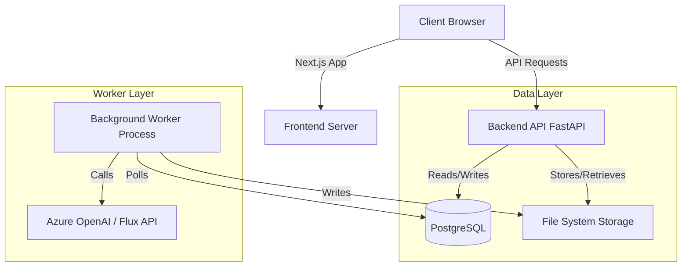

# MayaGen Architecture Documentation

## System Overview

MayaGen is an enterprise-grade synthetic image data platform designed to generate, edit, and manage high-quality AI-generated imagery at scale. The system is architected as a modern coupled application with a distinct separation of concerns between the user interface, API layer, and background processing workers.

### High-Level Architecture Diagram

---

## 1. Frontend Architecture (Client-Side)

The frontend is a **Next.js 14** application using the **App Router** architecture. It prioritizes performance, interactivity, and a premium user experience.

### Tech Stack
*   **Framework**: Next.js 14.1 (React 18)
*   **Language**: TypeScript
*   **Styling**: Tailwind CSS
*   **Component Library**: Shadcn UI (Radix Primitives)
*   **State Management**: React Context + URL State
*   **Icons**: Lucide React

### Key Modules
*   **Authentication**: Custom OAuth implementation (`app/auth/`) integrating with Google.
*   **Image Editor**: A sophisticated canvas-based editor (`app/edit/`) supporting:
    *   Drag-and-drop uploads.
    *   Real-time masking and in-painting.
    *   Comparison sliders (Before/After).
*   **Bulk Operations**: specialized wizards (`app/bulk-edit/`) for batch processing.

---

## 2. Backend Architecture (Server-Side)

The backend is a high-performance **FastAPI** application designed for asynchronous request handling and scalability.

### Tech Stack
*   **Framework**: FastAPI (Python 3.12)
*   **ORM**: SQLModel (SQLAlchemy + Pydantic)
*   **Database Driver**: `asyncpg` (Asynchronous PostgreSQL)
*   **Task Management**: Custom polling-based queue system (simpler than Celery/Redis for this scale).

### API Design Principles
*   **RESTful**: Resources (Images, Batches) are exposed via standard HTTP verbs.
*   **Type Safety**: Pydantic models ensure strict request/response schemas.
*   **Dependency Injection**: Database sessions and current user objects are injected into routes.

---

## 3. Database Schema (PostgreSQL)

The database acts as the single source of truth for application state and the job queue.

### Core Entities

*   **`User`**: Identity management.
    *   `id`, `email`, `hashed_password`, `google_id`.
*   **`Image`**: The central artifact.
    *   `id`, `user_id`: Ownership.
    *   `status`: State machine (`QUEUED`, `PROCESSING`, `COMPLETED`).
    *   `image_type`: Discriminator (`text_to_image`, `image_edit`).
    *   `edit_batch_job_id`: Link to parent batch job.
*   **`BatchJob`**: Container for Text-to-Image bulk request.
    *   `id`, `prompt`, `variations`.
*   **`EditBatchJob`**: Container for Image-to-Image bulk request.
    *   `original_image_id`: Source image.
    *   `edit_prompts`: List of target styles/prompts.
    *   `share_token`: For public sharing functionality.

---

## 4. Worker & Queue System

To handle long-running AI generation tasks without blocking the API, MayaGen uses a dedicated worker process.

### Queue Mechanism
The "Queue" is implemented directly in the PostgreSQL database using the `status` field on `Image` and `BatchJob` records.

### Worker Process (`workers/batch_worker.py`)
*   **Lifecycle**: Spawned as a `multiprocessing.Process` by `run_server.py`.
*   **Polling**: continuously queries the DB for jobs with `status='QUEUED'`.
*   **Execution Flow**:
    1.  **Claim**: Updates status to `PROCESSING` to prevent duplicate handling.
    2.  **Generate**: Calls external AI APIs (Azure OpenAI / Flux).
    3.  **Save**: Downloads result to local disk (`synthetic_dataset/`).
    4.  **Complete**: Updates status to `COMPLETED` and saves file path.
*   **Error Handling**: Catches exceptions, updates status to `FAILED`, and logs the error message.

### Scalability Note
This polling architecture simplifies deployment by removing the need for a separate message broker (Redis/RabbitMQ) but can be easily migrated to Celery if throughput requirements increase significantly.
