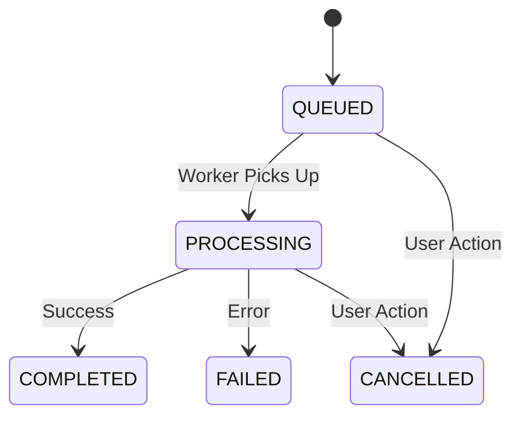
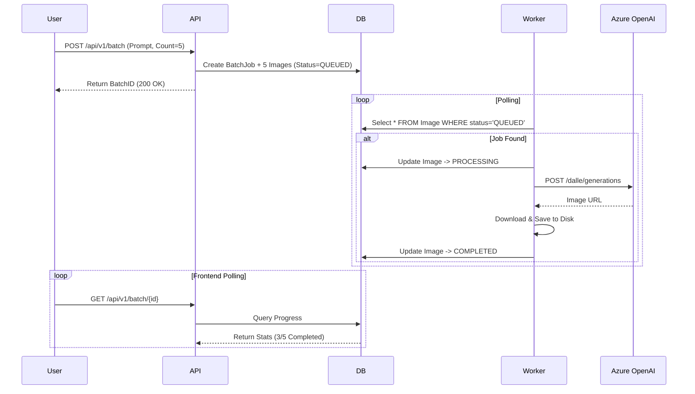
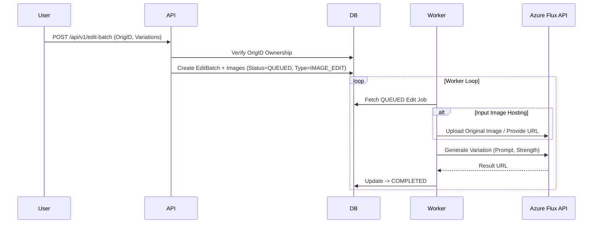

# Image Generation Workflows

This document details the lifecycle and data flow of image generation tasks within MayaGen.

## 1. Queue State Machine

Every generation task follows a strict state transition model.

---

## 2. Text-to-Image Flow

### Sequence Diagram

### Detailed Steps

1.  **Submission**: User submits a batch request. The API validates the quota and prompt format.
2.  **Expansion**: If a template (`{{color}} car`) is used, the API expands it into multiple distinct prompts.
3.  **Persistence**: Records are created in PostgreSQL with `QUEUED` status.
4.  **Processing**: The background worker picks up jobs FIFO (First-In-First-Out).
5.  **Completion**: On success, the image is stored in `synthetic_dataset/{category}/`. On failure, the `error_message` is logged.

---

## 3. Image Editing Flow

### Sequence Diagram

### Key Differences from Text-to-Image

*   **Input Handling**: Requires an existing image. The worker must resolve the file path of the *original* image (`synthetic_dataset/...`) and provide it to the AI provider.
*   **Providers**: Uses **FLUX.1-Kontext-pro** (via Azure) instead of DALL-E 3.
*   **Masking**: Supports partial editing if a mask is provided (currently backend implementation pending for advanced storage).

---

## 4. Error Handling & Recovery

*   **Retry Logic**: The worker setup includes a `retry_failed_jobs.py` script that can reset `FAILED` jobs back to `QUEUED`.
*   **Timeouts**: If a worker crashes while `PROCESSING`, the job remains stuck. A cleanup task (on server restart) resets stuck `PROCESSING` jobs to `QUEUED`.
*   **Concurrency**: Multiple worker processes can run in parallel (configured via `run_server.py`), leveraging database row locking (if implemented) or atomic updates to prevent double-processing.
